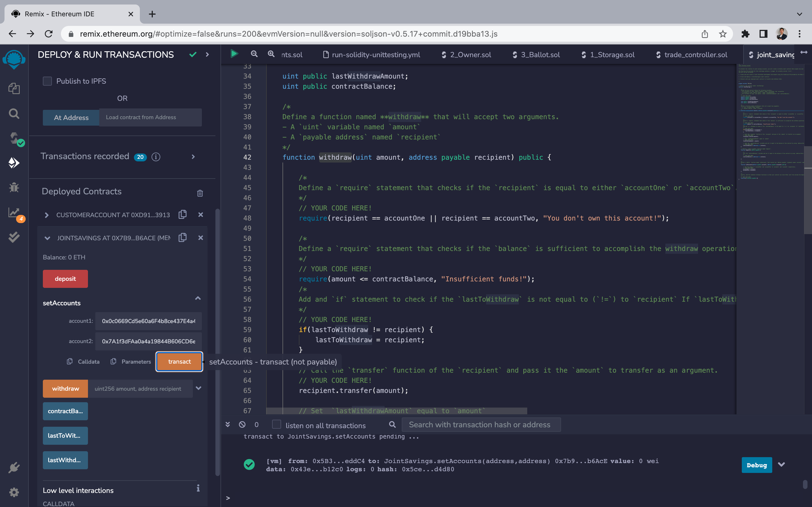
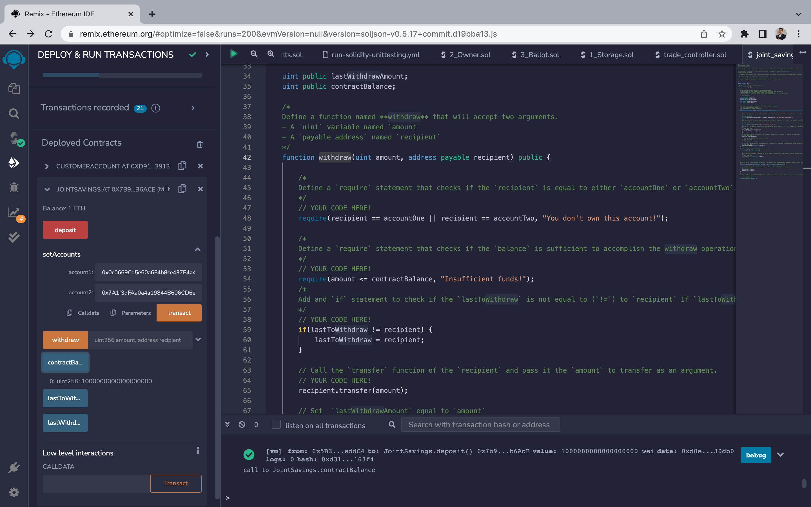
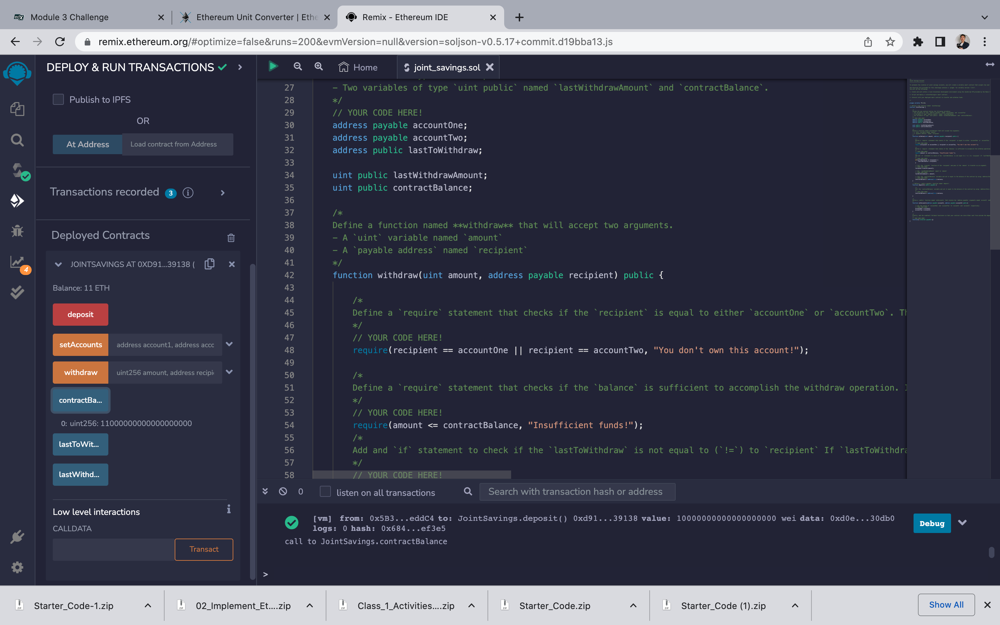
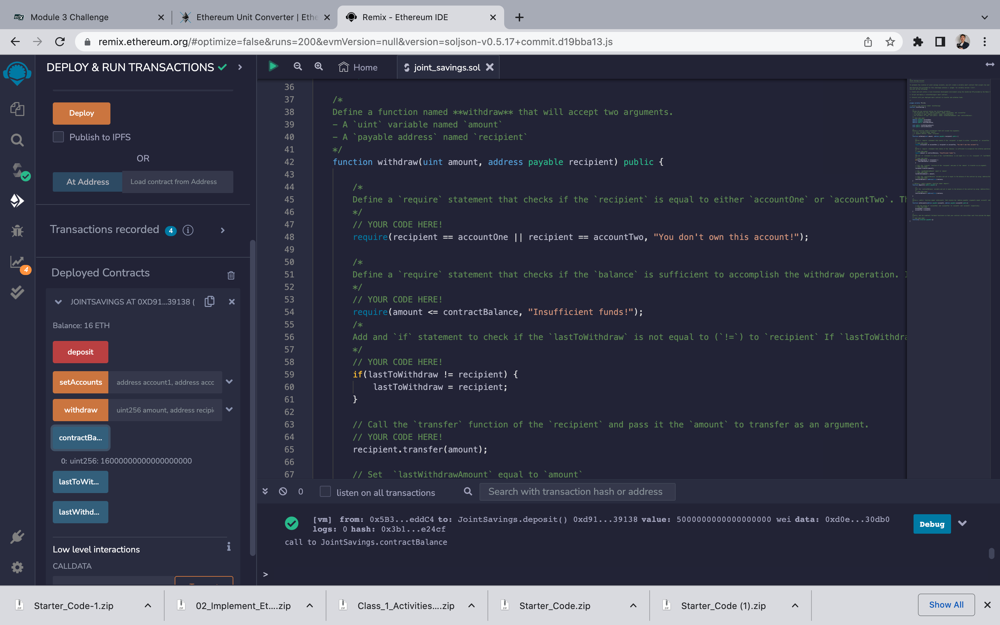
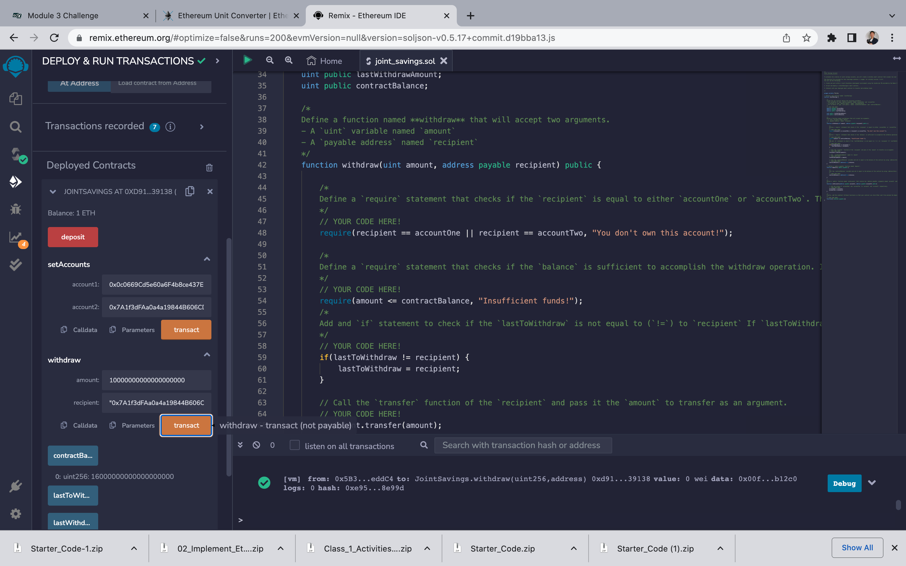
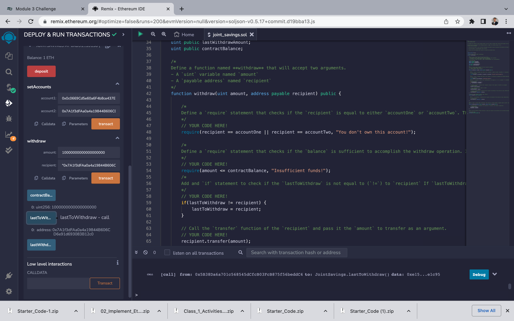
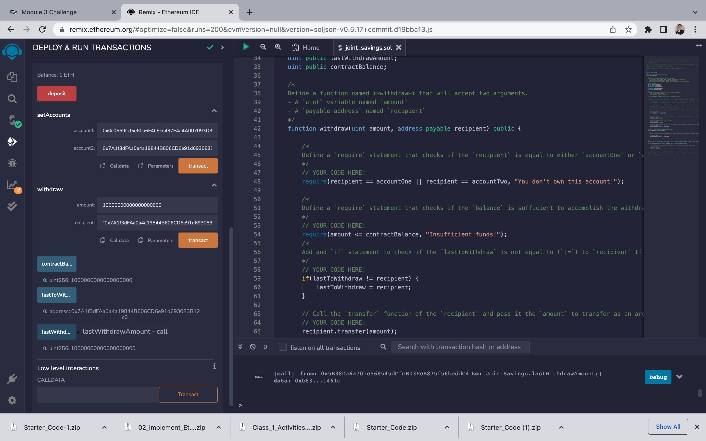

# JointSaving-Solidity

Pathway Module 3 Challenge

# Screenshot 1 : SetAccounts

# Screenshot 2 : deposit 1eth as Wei

# Screenshot 3 : deposit 10eth as Wei

# Screenshot 4 : deposit 5eth

# Screenshot 5 : withdraw 5eth to account 1

# Screenshot 6 : withdraw 10eth to account 2

# Screenshot 7 : lastToWithdraw

# Screenshot 8 : lastToWithdrawAmount
